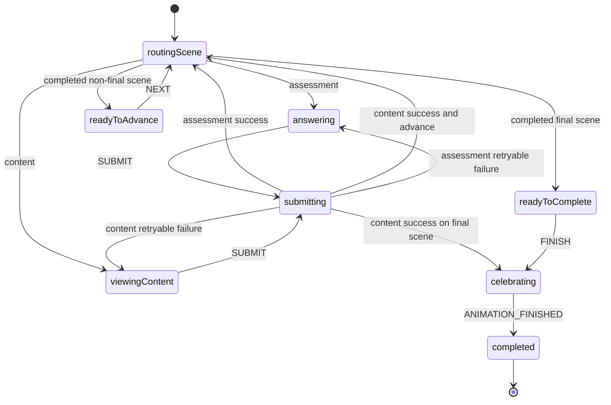

# Learning: Start Here

Learning owns enrollment-facing dashboards, the member and anonymous course
players, progression, grading, attempts, completion, and certificates. Read:

1. `course-player/member/screen.tsx` — authenticated player entry and hydration.
2. `course-player/ui/player/components/course-player-root.tsx` — player state
   composition.
3. `course-player/ui/player/lesson-player/progression/lesson-progression.machine.ts`
   — the hierarchical client lifecycle.
4. `course-player/ui/player/lesson-player/utils/useLessonProgression.ts` — UI
   wiring and derived presentation.
5. `progression/server/complete-scene.ts` — authoritative completion transition.
6. `progression/server/persist-completion.ts` and
   `progression/server/finish-member-course.ts` — transactional progress writes.

## Content loading

Course queries return a lightweight manifest containing only player-facing
lesson metadata, scene presentation fields, canonical scene `kind`, and
server-computed lesson/course `maxSp`; they do not return point-summary inputs,
`studentContent`, or `gradingManifest`. When a lesson opens,
`use-scene-content.ts` loads only the active scene through the mode-specific
member, anonymous, or preview endpoint. While that request is in flight, only
the immediate next scene is prefetched concurrently into the tRPC query cache.
Previously visited scenes remain cached for back navigation. Preview scene queries
stay fresh on mount so author drafts reflect the latest document state; preview
manifest totals are derived explicitly from draft TipTap JSON.

## Progression path

1. **UI:** `LessonPlayer` calls `useLessonProgression`. The hook reads the active
   TipTap QA store, validates required answers, and captures one immutable scene
   submission.
2. **XState:** the hook sends that submission to
   `lessonProgressionMachine`. Its `playing` state distinguishes assessment,
   content, a shared submission invoke, post-submit routing, and
   ready-to-advance/complete phases; feedback, errors, navigation, read-only
   mode, and SP presentation are derived from machine state, scene-order rules,
   and context.
3. **Selected submit callback:** `use-submit-scene.ts` selects exactly one tRPC
   mutation from `ProgressionMode`: member and anonymous use
   `sceneProgress.completeScene`; preview uses the write-free
   `sceneProgress.previewScene`.
4. **Authoritative server transition:** the complete-scene router delegates to
   `completeMemberScene` or `completeAnonymousScene`. Inside an attempt lock and
   transaction, `transitionAttempt` rejects skipped/finished progress and treats
   duplicate completion as idempotent before server-only grading is applied.
5. **Persistence:** accepted member and anonymous results flow through
   `persist-completion.ts` to conflict-safe `SceneProgress`/`SceneAnalytics`
   writes, then member completion may update the enrollment and issue a
   certificate. The normalized graded blocks and earned SP return to the invoked
   XState actor, which alone updates client progression context.

Public machine events are `SUBMIT`, `NEXT`, `FINISH`, `GO_TO_SCENE`, `EXIT`,
and `ANIMATION_FINISHED`. Submission completion and failure are internal
invoked actor outcomes.

Tests closest to this path: `progression/progression-rules.test.ts`,
`shared/content/learning/published-scene-summary.test.ts`,
`lesson-player/progression/lesson-progression.machine.test.ts`,
`course-player/ui/player/lesson-player/utils/useLessonProgression.test.ts`, and
the learning Playwright specs.
