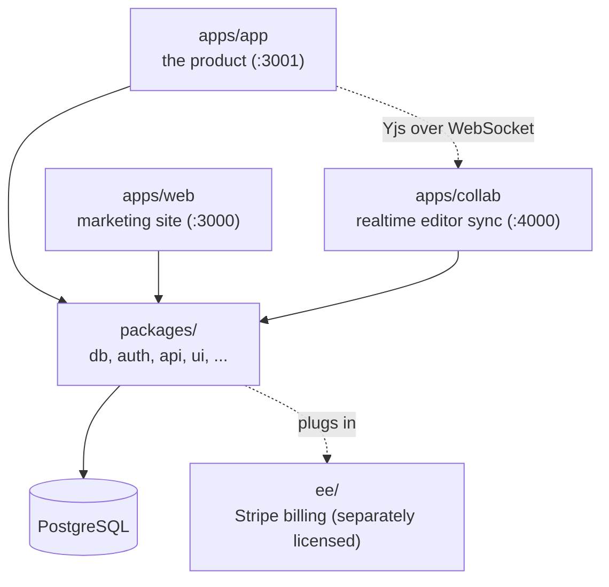

# Architecture

Three deployables, one Postgres database, a layer of shared packages —
pnpm + Turborepo monorepo.

- **`apps/app`** — the product: notebook (AI drafts a course from an
  author's sources), course authoring, learning/player, organizations, auth.
  See [apps/app/src/ARCHITECTURE.md](../apps/app/src/ARCHITECTURE.md) for how
  its code is organized internally.
- **`apps/web`** — the public marketing site (landing, blog, legal). Shares
  auth and billing with `apps/app`.
- **`apps/collab`** — a standalone Hocuspocus/Yjs server for realtime course
  editing, deployed separately from the two Next.js apps.
- **`packages/`** — shared code: `db` (Prisma/Postgres schema, the source of
  truth), `auth` (better-auth), `api` (tRPC + entitlement), plus `ui`,
  `i18n`, `email`, `observability`, and lower-level helpers.
- **`ee/`** — the one cloud-specific piece (Stripe billing), separately
  licensed — see [ee/README.md](../ee/README.md).

For the product's domain concepts (Organizations, Notebook, Course
authoring, Learning, ...) see [CONTEXT-MAP.md](../CONTEXT-MAP.md). Notable
design decisions are recorded in [docs/adr/](adr/).
